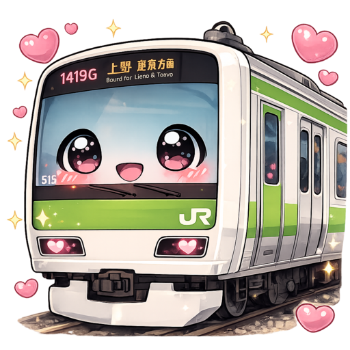
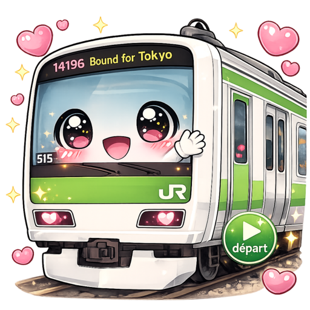
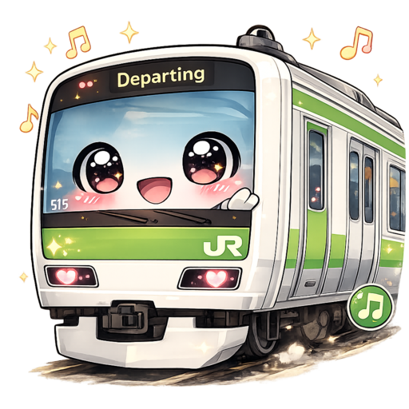
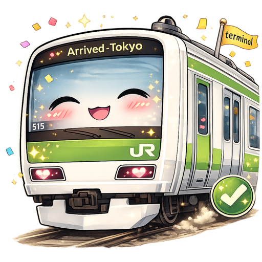
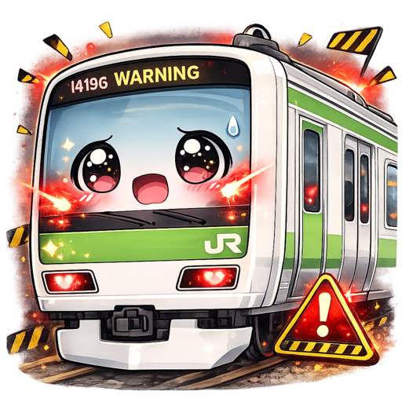
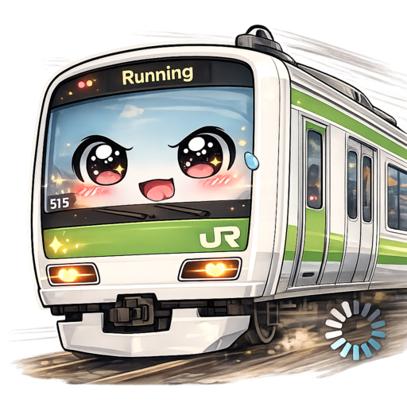
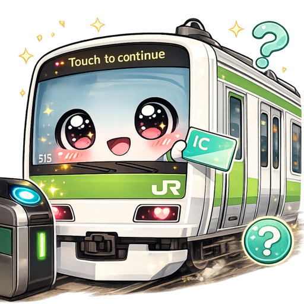
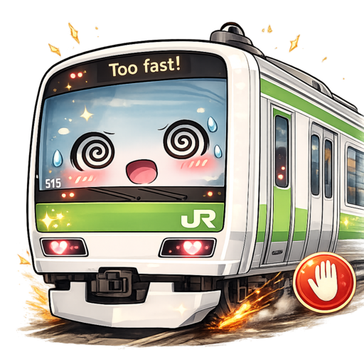
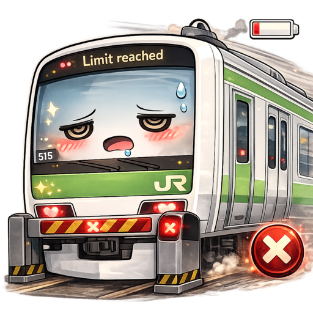

  

# OpenPeon - Yamanote Sounds 🚄💚

A [CESP](https://openpeon.com)-compliant sound pack for [OpenPeon](https://openpeon.com) featuring authentic Japanese train station jingles and public address announcements, themed on Tokyo's **Yamanote Line** and paired with a kawaii **E235 train mascot** that reacts to every event state.

> A fork of [japan-rail](https://github.com/adambullmer) by Adam Bullmer, extended with a custom kawaii icon set — one mascot expression per event lifecycle state.

## Description

Step onto the platform and let your coding sessions run on the Yamanote Line. This pack brings the iconic soundscape of Japanese rail travel to your agentic IDE with departure melodies, arrival chimes, gate beeps, and platform safety warnings all mapped to your AI assistant's event lifecycle — each one fronted by its own mascot icon, from a cheerful "doors closing" wave to a dizzy "too fast!" screech.

Whether you're waiting for a tool call to complete or watching a task run off the rails, Yamanote Sounds keeps you on schedule.

## Installation

Install via the [OpenPeon registry](https://openpeon.com) or manually:

1. Download or clone this repository.
2. Point your OpenPeon-compatible player at the directory containing `openpeon.json`.

## Supported Categories

| Icon | Category           | # Sounds | Description                                                       |
| ---- | ------------------ | -------- | --------------------------------------------------------------- |
|    | `session.start`    | 3        | Boarding melodies when a session opens                          |
|  | `task.acknowledge` | 30       | The authentic departure melody of **every Yamanote Line station** |
|     | `task.complete`    | 3        | Iconic station melodies as an arrival flourish                  |
|        | `task.error`       | 2        | Fighting Spirit / a JR melody as a warning                      |
|     | `task.progress`    | 2        | Rolling melodies for long-running tasks                         |
|    | `input.required`   | 2        | Gate-style chimes played when user input is needed              |
|         | `user.spam`        | 1        | Fighting Spirit when requests come in too fast                  |
|    | `resource.limit`   | 2        | Station chime / JR melody when quota or token limits are reached |

## Sound Details

Every sound is a Yamanote Line departure melody (発車メロディ). `task.acknowledge` plays a different station each time — the full loop, in order.

### `task.acknowledge` — the full Yamanote loop (30 stations)

| Station | Melody |
| ------- | ------ |
| Tokyo 東京 | Departure Melody |
| Kanda 神田 | Seseragi (Babbling Brook) |
| Akihabara 秋葉原 | Ogawa no Sasayaki |
| Okachimachi 御徒町 | Haru (Spring) |
| Ueno 上野 | Flower Shop |
| Uguisudani 鶯谷 | Haru (Spring) |
| Nippori 日暮里 | Haru (Spring) |
| Nishi-Nippori 西日暮里 | Haru (Spring) |
| Tabata 田端 | Haru (Spring) |
| Komagome 駒込 | Sakura Sakura |
| Sugamo 巣鴨 | Haru (Spring) |
| Ōtsuka 大塚 | Haru (Spring) |
| Ikebukuro 池袋 | Departure Melody |
| Mejiro 目白 | Haru (Spring) |
| Takadanobaba 高田馬場 | **Astro Boy** (Tetsuwan Atom) |
| Shin-Ōkubo 新大久保 | Spring |
| Shinjuku 新宿 | Aratana Tabidachi |
| Yoyogi 代々木 | Haru (Spring) |
| Harajuku 原宿 | Departure Melody |
| Shibuya 渋谷 | Hana no Hokorobi |
| Ebisu 恵比寿 | **The Third Man** |
| Meguro 目黒 | Water Crown |
| Gotanda 五反田 | Departure Melody |
| Ōsaki 大崎 | Umi no Eki |
| Shinagawa 品川 | Seseragi |
| Takanawa Gateway 高輪ゲートウェイ | Sweet Call |
| Tamachi 田町 | Seseragi |
| Hamamatsuchō 浜松町 | Seseragi |
| Shimbashi 新橋 | Gota del Viento |
| Yūrakuchō 有楽町 | Departure Melody |

### Other states

- **`session.start`** — Spring Box / Sunlight / Mellow Time, as a "welcome aboard"
- **`task.complete`** — Twinkling Skyline / Beyond the Line / Beautiful Hill (arrival flourish)
- **`task.progress`** — Haru tremolo / Tokyo melody (train rolling)
- **`input.required`** — station chime / Sweet Call (Takanawa Gateway)
- **`task.error`** — Fighting Spirit / JR melody (SF-1) as an alert
- **`user.spam`** — Fighting Spirit as an alert
- **`resource.limit`** — station chime / JR melody (SF-3)

> These non-departure states borrow other Tokyo-area JR melodies. Dedicated arrival announcements, gate chimes and warning sounds can be layered in later.

## Copyright

The melodies are Yamanote Line departure jingles (発車メロディ); the compositions remain &copy; their respective composers and JR East. This pack is an unofficial fan project with no claim of ownership over the audio content.

## Credits

- Yamanote departure melodies from [morgansleeper/Yamanotes](https://github.com/morgansleeper/Yamanotes)
- Departure melody compositions &copy; their composers (incl. Minoru Mukaiya, Switch / Hiroaki Ide) and JR East
- Forked from [japan-rail](https://github.com/adambullmer) by Adam Bullmer
- Kawaii E235 mascot icon set generated for this fork
